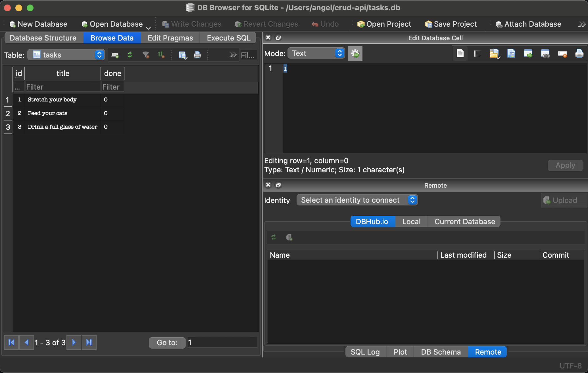

# Full CRUD Task Manager API

A simple CRUD API for managing tasks, built with FastAPI and backed by SQLite.

## Why SQLite?
SQLite was chosen because this project is small and single-user, so a full database server would be overkill.

- **Zero setup:** there is no server to install, configure, or keep running.
- **Built into Python:** the `sqlite3` module ships with the standard library, so there is no extra dependency.
- **Single file:** the whole database is one file, which makes it easy to inspect, back up, reset, or delete.
- **Real SQL:** it still gives you tables, constraints, and persistent storage, unlike an in-memory list that disappears on restart.

The trade-off is that SQLite handles limited concurrent writes, so for a multi-user production app a server database such as PostgreSQL would be the better fit.

## Where is the database stored?
The database is a single file named `tasks.db`, located in the project root (next to `main.py`).

```
crud-api/
├── main.py
├── requirements.txt
├── tasks.db        <-- SQLite database file
└── images/
```

The file is created automatically the first time the server starts. To reset all data, stop the server and delete `tasks.db`. It will be recreated empty on the next start.

## Installation
**Pre-requisites**
- Python 3.10+
- pip

```bash
git clone https://github.com/primecodes-ops/crud-api.git
cd crud-api
```

### Create a virtual environment
```bash
python3 -m venv .venv   # macOS/Linux
python -m venv .venv    # Windows
```

### Activate .venv first
```bash
source .venv/bin/activate   # macOS/Linux
.venv\Scripts\activate      # Windows
```

### Install dependencies
```bash
pip install -r requirements.txt
```

## How to start the project
Once the dependencies are installed and the virtual environment is active, run:

```bash
uvicorn main:app --reload
```

- The server runs at `http://localhost:8000`.
- Interactive docs (Swagger UI) are at `http://localhost:8000/docs`.
- On first start, `tasks.db` is created automatically.

## API Endpoints Summary
| Method | API Endpoint | Description |
|--------|--------------|-------------|
| GET    | /tasks/      | Gets all tasks |
| GET    | /tasks/{id}  | Gets a task using id |
| POST   | /tasks/      | Creates a task |
| PUT    | /tasks/{id}  | Updates a task |
| DELETE | /tasks/{id}  | Deletes a task |

## Requests using curl
*{} are only placeholders. Replace them with the variable inside them excluding the {}*

Get all tasks
```bash
curl -i http://localhost:8000/tasks
```

Get a task using id
```bash
curl -i http://localhost:8000/tasks/{id}
```

Create a task
```bash
curl -i -X POST http://localhost:8000/tasks -H "Content-Type: application/json" -d '{"title": "{title}"}'
```

Update a task
```bash
curl -i -X PUT http://localhost:8000/tasks/{id} -H "Content-Type: application/json" -d '{"title":"{title}", "done": false}'
```

Delete a task
```bash
curl -i -X DELETE http://localhost:8000/tasks/{id}
```

## Requests example using curl
### API Swagger UI Screenshot


---

### GET /tasks Swagger UI Screenshot

```bash
curl -i http://localhost:8000/tasks
```
---

### GET /tasks/{id} Swagger UI Screenshot

```bash
curl -i http://localhost:8000/tasks/1
```
---

### POST /tasks Swagger UI Screenshot

```bash
curl -i -X POST http://localhost:8000/tasks -H "Content-Type: application/json" -d '{"title": "Read Module 1"}'
```
---

### PUT /tasks/{id} Swagger UI Screenshot

```bash
curl -i -X PUT http://localhost:8000/tasks/1 -H "Content-Type: application/json" -d '{"title":"add README", "done": false}'
```
---

### DELETE /tasks/{id} Swagger UI Screenshot

```bash
curl -i -X DELETE http://localhost:8000/tasks/5
```

## Database viewer
The contents of `tasks.db` can be inspected with a database viewer such as [DB Browser for SQLite](https://sqlitebrowser.org/). The screenshot below shows the `tasks` table after creating a few tasks through the API.



## Example SQL query
This query, run in the database viewer, lists every task that has not been completed yet:

```sql
SELECT id, title, done
FROM tasks
WHERE done = 0;
```