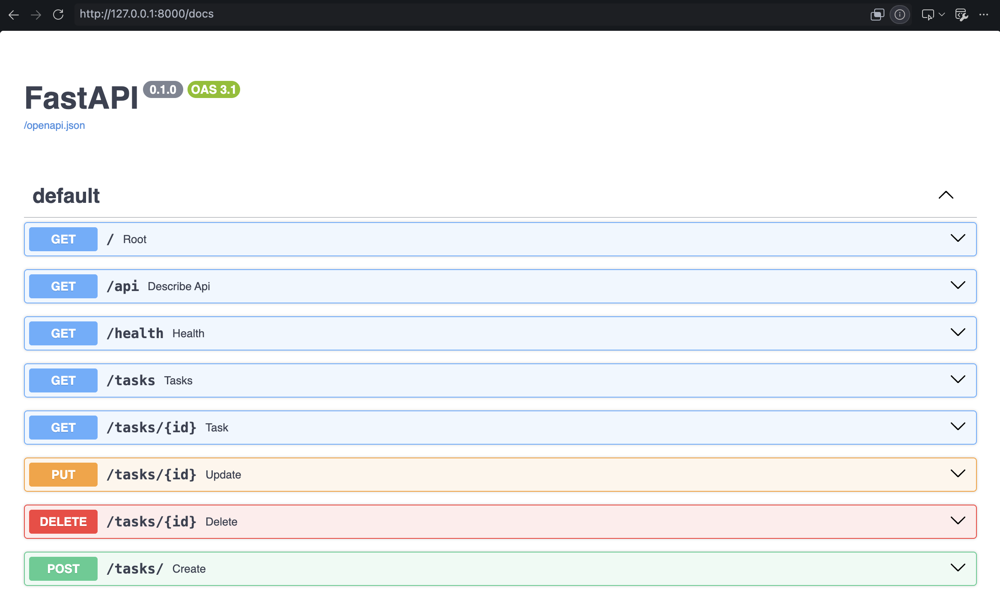
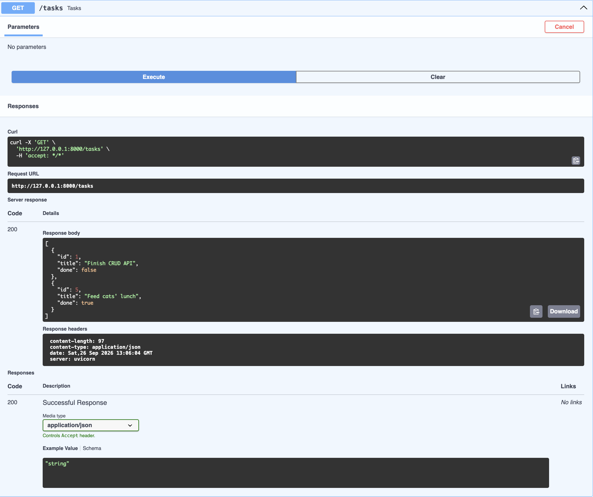
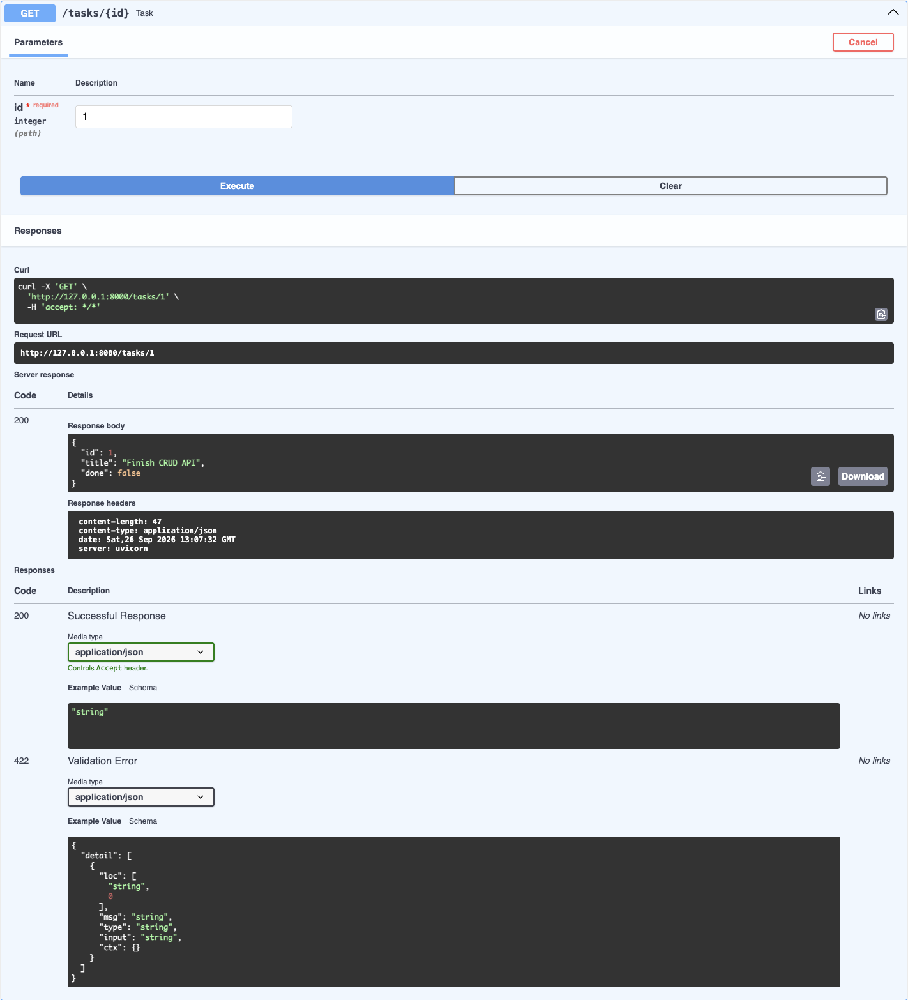
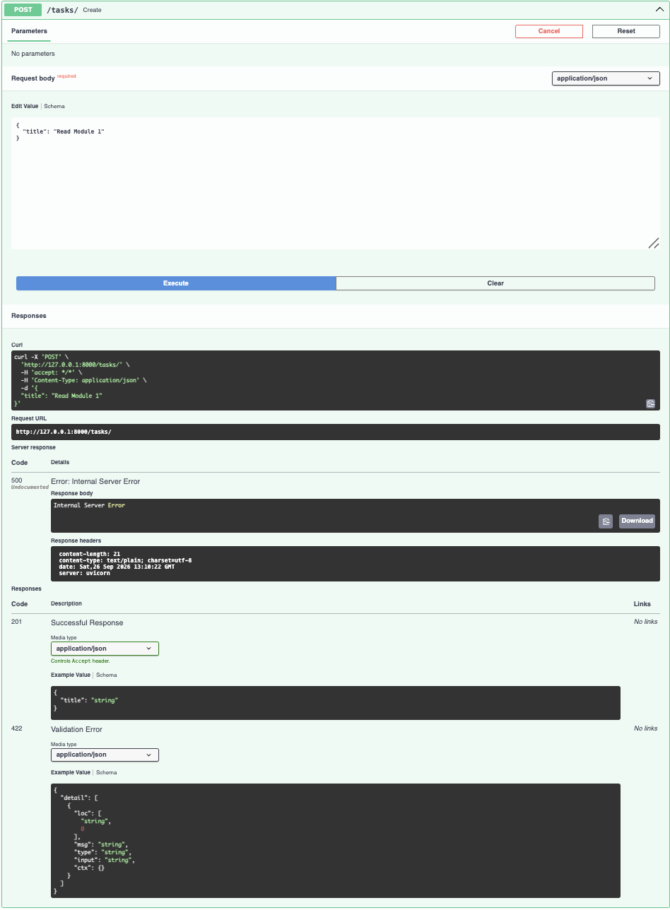
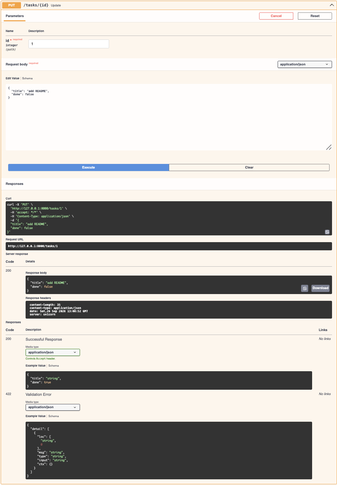
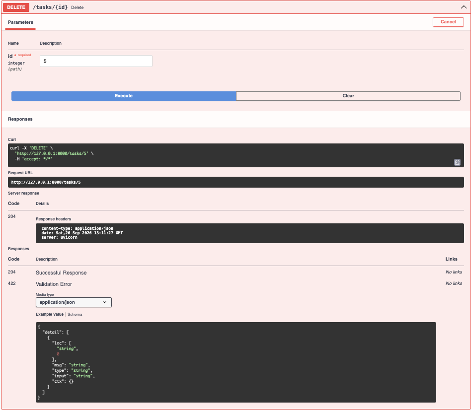

# Full CRUD Task Manager API

A simple CRUD API for managing tasks, built with FastAPI.

## Installation
Pre-requisites
- Python 3.10+
- pip

\`\`\`bash
git clone https://github.com/primecodes-ops/crud-api.git
cd crud-api
pip install -r requirements.txt
\`\`\`

## Running the server
\`\`\`bash
uvicorn main:app --reload
\`\`\`

Server runs at `http://localhost:8000`. Interactive docs at `http://localhost:8000/docs`

## API Endpoints Summary
| Method | API Endpoint | Description |
|--------|--------------|-------------|
| GET    | tasks/       | Gets all tasks |
| GET    | tasks/{id}   | Gets a task using id |
| POST   | /tasks/      | Creates a task |
| PUT    | /tasks/{id}  | Updates a task |
| DELETE | /tasks{id}   | Deletes a task |

## Requests using curl
*{} are only placeholders. Replace them with the variable inside them excluding the {}*

***Get all tasks***
```bash
curl -i http://localhost:8000/tasks
```

***Get a task using `id`***
```bash
curl -i http://localhost:8000/tasks/{id}
```

***Create a task***
```bash
curl -i -X POST http://localhost:8000/tasks -H "Content-Type: application/json" -d '{"title": "{title}"}'
```

***Update a task***
```bash
curl -i -X PUT http://localhost:8000/tasks/{id} -H "Content-Type: application/json" -d '{"title":"Buy bread", "done": false}'
```

***Delete a task***
```bash
curl -i -X DELETE http://localhost:8000/tasks/{id}
```

## Requests example using curl
***API Swagger UI Screenshot***


***GET tasks/ Swagger UI Screenshot***

```bash
curl -i http://localhost:8000/tasks
```

***GET tasks/{id} Swagger UI Screenshot***

***Get a task using `id`***
```bash
curl -i http://localhost:8000/tasks/1
```

***POST tasks/{id} Swagger UI Screenshot***

```bash
curl -i -X POST http://localhost:8000/tasks -H "Content-Type: application/json" -d '{"title": "Read Module 1"}'
```

***PUT tasks/{id} Swagger UI Screenshot***

```bash
curl -i -X PUT http://localhost:8000/tasks/1 -H "Content-Type: application/json" -d '{"title":"add README", "done": false}'
```

***DELETE tasks/{id} Swagger UI Screenshot***

```bash
curl -i -X DELETE http://localhost:8000/tasks/5
```
